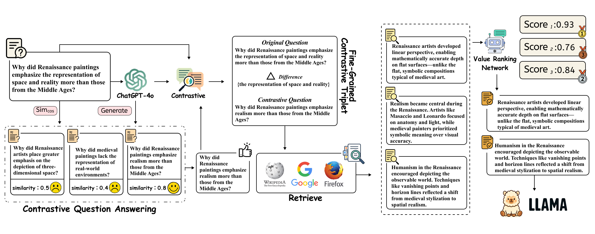

# RaCoT: Plug-and-Play Contrastive Example Generation Mechanism for Enhanced LLM Reasoning Reliability
> Official code for the AAAI 2026 oral paper [“RaCoT: Plug-and-Play Contrastive Example Generation Mechanism for Enhanced LLM Reasoning Reliability”](https://arxiv.org/abs/2510.22710).  

[English](README.md) | [中文](README_zh.md)

